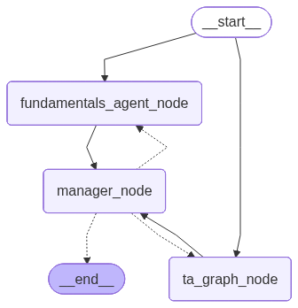

AI Trader
--

AI Trader is a full stack application that uses a **multi agent system** to perform different financial analysis about a specific ticker symbol served by a backend system using **FastAPI**.

The system is builded using **langgraph** and **LLMs**. The graph has three [main nodes](https://github.com/c-azb/aitrader/blob/main/backend_app/src/MAIN_GRAPH/main_graph.py), the **fundamental analysis node**, **technical analysis node** and **manager node**.

[**Fundamental analysis node**](https://github.com/c-azb/aitrader/tree/main/backend_app/src/FUNDAMENTALS_AGENT) is a single agent that research and provide reports about the fundamentals of the financial asset.

[**Technical analysis node**](https://github.com/c-azb/aitrader/tree/main/backend_app/src/TA_GRAPH) is builded with two agents, one is responsible to make research about technical analysis defining which chart configurations should use, and the second agent analyse the chart image to provide the final report.

Finally the **manager** receives the reports from both sectors and provide requests from the sectors if needed, otherwise provide a final report.

Graph
--

Disclaimer
--
This application is for learning purposes only, no personal investment advice should be taken.

Frontend App
--
Frontend app includes a simple <b>Flutter</b> application that sends requests to the AITrader API and display the responses at a friendly view for the user. 